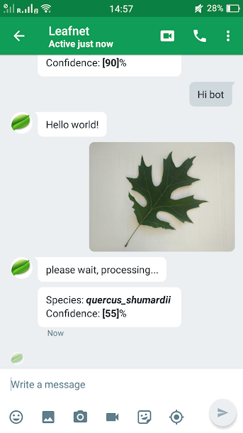

#  Leafnet

Understanding and preserving worldwide biodiversity is central to addressing challenges associated with resilience to climate change and reducing the impact of greenhouse gases. Amidst growing threats to biodiversity - such as deforestation, overexploitation, or pollution - species conservation becomes increasingly important. Plant species identification - a fundamental first step to quantifying biodiversity - can be challenging for both researchers and the general public. Therefore, the ability to reliably and easily identify plant species holds great potential to increase knowledge accesssibility as well as facilitate greater collective ability to protect the environment. With this goal in mind we designed an algorithm that takes as an input an RGB leaf image. We then used a ResNet18 to classify the image into 1 of 185 classes corresponding to its species. The model was tuned for various hyperparameters to achieve an overall top-1 precision of 93.8\% on the dev set which is higher than any previously known model. The final model is hosted on a remote server and allows anyone to use the classifier for free by logging into Google Hangouts and opening a chat with leafnetstanford@gmail.com.

|               | Top-1 Precision| Top-5 Precision|
|---------------|:--------------:|:--------------:|
|    Leafsnap   |      70.8%     |      96.8%     |
| Deep-Leafsnap |      86.2%     |      98.4%     |
| **Leafnet**   |    **93.8%**   |    **99.5%**   |

We noticed that our model failed to recognize specific classes of trees constantly causing our overall precision to derease. This is primarily due to the fact that those trees had very small leaves (like pines) which were hard to preprocess and crop.

The following goes over the code and how to set it up on your own machine <presented verbatim from the original [Deep-Leafsnap repository](https://github.com/sujithv28/Deep-Leafsnap). 

## Try it now!
**Note: Leafnet bot was taken down in Jan-2019 because I cannot afford to keep my server running. If you are interested in using Leafnet for scientific or educational purposes, create a new issue for this repository and I will switch on Leafnet for you.**

Leafnet is available for free via a remote server based system. All you need is an app called Google Hangouts. Follow these steps to use the prediction bot:
* Iphone users: install [Google hangouts](https://itunes.apple.com/us/app/hangouts/id643496868?mt=8). Android devices have it by default
* Start a chat with leafnetstanford@gmail.com
* Say _"Hi bot"_
* That's it! Send as many pictures of tree leaves on white background and find their species now!


 

## Files
* `model.py` trains a convolutional neural network on the dataset.
* `vgg.py` PyTorch model code for VGG-16.
* `densenet.py` PyTorch model code for DenseNet-121.
* `resnet.py` PyTorch model code for ResNet.
* `dataset.py` creates a new train/test dataset by cropping the leaf and augmenting the data.
* `utils.py` helps do some of the hardcore image processing in dataset.py.
* `averagemeter.py` helper class which keeps track of a bunch of averages when training.
* `leafsnap-dataset-images.csv` is the CSV file corresponding to the dataset.
* `requirements.txt` contains the pip requirements to run the code.

## Installation
To run the models and code make sure you [Python](https://www.python.org/downloads/) installed.

Install PyTorch by following the directions [here](http://pytorch.org/).

Clone the repo onto your local machine and cd into the directory.
```
git clone https://github.com/sujithv28/Deep-Leafsnap.git
cd Deep-Leafsnap
```

Install all the python dependencies:
```
pip install -r requirements.txt
```
Make sure sklearn is updated to the latest version.
```
pip install --upgrade sklearn
```
Also make sure you have OpenCV installed either through pip or homebrew. You can check if this works by running and making sure nothing complains:
```
python
import cv2
```
Download Leafsnap's image data and extract it to the main directory by running in the directory. Original data can be found [here](http://leafsnap.com/dataset/).


## Create the Training and Testing Data
To create the dataset, run
```
python dataset.py
```
This cleans the dataset by cropping only neccesary portions of the images containing the leaves and also resizes them to `64x64`. If you want to change the image size go to `utils.py` and change `img = misc.imresize(img, (64,64))`to any size you want.

## Training Model
To train the model, run
```
python model.py --modelid 1 --resume ''
```

## Setting up your own hangouts bot
To set up your own hangouts bot such as the one running on leafnetstanford@gmail.com,
From root directory of leafnet, 

```
git submodule add -b v3.0 https://github.com/kkraoj/hangoutsbot.git ./
```
After adding the hangoutsbot as a submodule, follow the initial setup instructions in [hangousbot readme](https://github.com/kkraoj/hangoutsbot/tree/v3.0).


